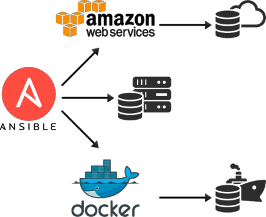
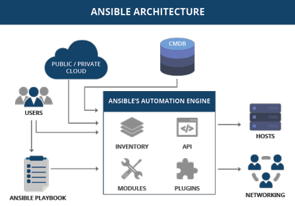
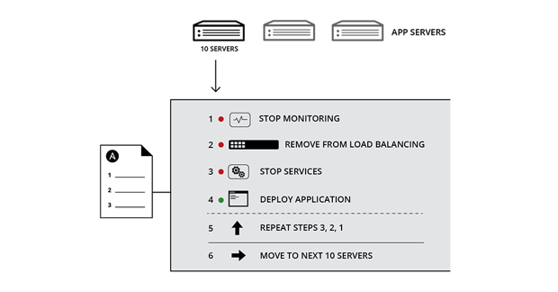
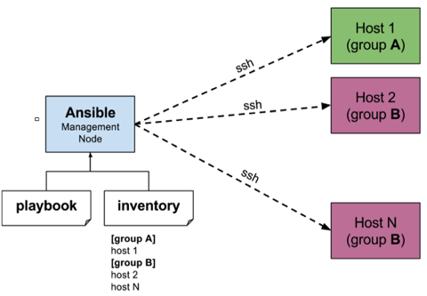
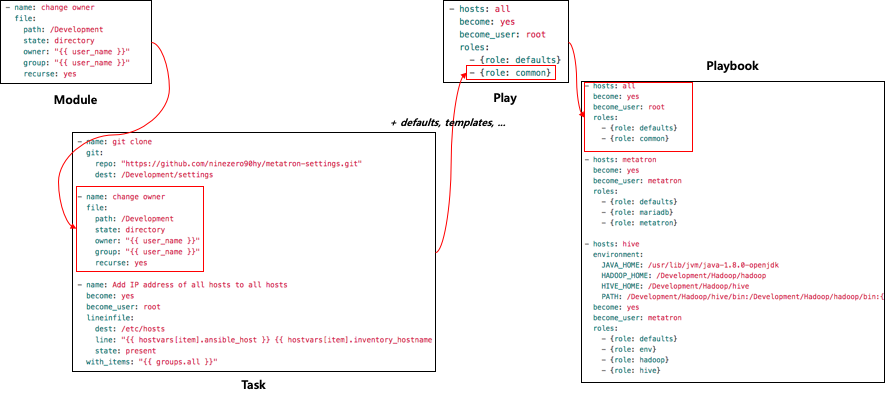
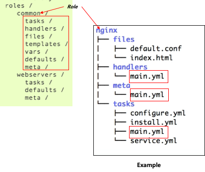
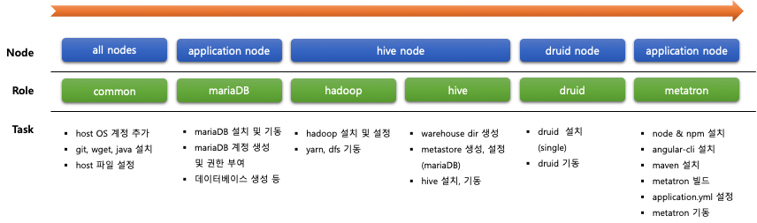

# Seminar Ansible

# ***Ansible이란?***

## **Ansible은 Automation을 위한 오픈소스로 DevOps, Provision 의 실현에 도움을 줄 수 있다.**

- Apache Top Project, Python Github Top Project
- Provision & Configuration management tool

## **Ansible의 개발언어는 Python 이고 구현을 위한 정의는 YAML을 이용한다.**

- Agent-less 로 대상 host에 client 프로그램과 같은 agent를 설치할 필요가 없음
- SSH로 접속 가능한 host라면 대부분 Ansible 로 정의된 task를 실행할 수 있음
- 기본 정의가 YAML 형식이기 떄문에 다른 provision tool에 비해 비교적 간단하게 기술할 수 있음
- 이미 수년전부터 사용되고 있었기 때문에 활용가능한 module과 document가 존재
- 멱등성이 담보될 수 있음. (idempotence : 같은 조작을 몇번이고 수행하더라도 같은 결과를 얻을 수 있음)
- 수많은 module로 구성하고 개별 module만을 실행할 수도 있음.(Ad-hoc)

# ***왜 Ansible인가?***

- 복잡성은 생산성을 떨어뜨린다.
    - 우리와 같은 개발 중심의 회사에게는 OS에 따른 Java 설치, DB 설치 및 설정, 환경변수 설정, OS 설정 등과 같은 개발환경 구성처럼익숙하지 않으나 반복적으로 발생되는 작업들이 있습니다.이는 결국 주 목적인 개발에 대한 생산성 저해로 연결됩니다.
    - Ansible은 이러한 수많은 수작업과 복잡, 반복되는 작업을 자동화하고 개발에 있어서 DevOps와 Provision을 구체화해 줄 수 있습니다.
- 긍정적인 영향
    - 시간을 절약하고 생산성 향상
    - 반복적인 작업 제거
    - 오류 및 오류 감소
    - 협업 및 직무 만족도 향상

    

    # ***Ansible 사용사례***

    - Provisioning
        - Infrastructure provisioning 을 자동화 하는 것은 Application lifecycle(그림 참고)를 자동화 하기위한 첫번째 단계로 베어메탈, 가상화된 Host 및 Hypervisor, Network 등에 대한 연결, 설치, 설정, 패치 등 Infrastructure와 관련된, 그리고 대상에 구분을 두지 않는 거의 대부분의 사항을 포함할 수 있다.
    - Ex )
        - Host 에 사용자를 추가
        - CentOS 의 yum update
        - unzip, git, wget, JDK 설치
        - 환경변수에 JAVA_HOME 설정
        - 필요 Directory 생성
        - 필요한 파일을 복사, 배포 등

    

    # ***Configuration management***

    - 대부분의 관련업계 또는 팀들은 특정 관리자를 두고 일련의 스크립트나 Case별 대응 방안을 이용하여 시스템을 관리하고 있습니다.
    - 이는 특정 인물이나 또다른 Framework에 의존도가 높아지게되고 그에 따라 유지보수에 많은 시간과 위험부담이 발생하게 됩니다.
    - 또한 최근 가상화/클라우드 기술로 인해 시스템의 수가 증가하고 그에 따른 시스템의 복잡성이 커지고 있습니다.
    - Ansible은 사용 가능한 구성 관리를위한 가장 간단한 솔루션으로 관리자, 개발자 및 IT 관리자를위한 학습 곡선이 매우 낮고 자연스럽고일관성 있고 안전하며 높은 신뢰성을 제공하도록 설계되었습니다.단지 필요한 것은 YAML과 SSH 입니다.

    

    # ***Application deployment***

    - 하나의 공통 Framework로 여러 계층의 Application을 안정적이고 일관되게 배포할 수 있습니다.
    - 단순 Application 뿐 아니라 필요에 따라 서비스를 구성하게도 할 수 있습니다.
    - Build와 Deploy 그리고 WAS에 대한 start/stop까지도 module로 구성하여 전체를 실행하거나 일부만을 실행할 수 있습니다.
    - Docker와 같은 Container 기반의 Platform을 이용하는 경우 Container에 대한 Scale도 조정 가능 할 것입니다.

    

    # ***Ansible의 구조***

    ## ***기본 요소는 YAML, Playbook, Inventory 이다.***

    - **YAML** :
        - Ansible 의 정의 형식 및 방법
    - **Playbook** :
        - 수행할 Task의 집합체.
        - 단위는 작은 것부터 Module -> Role -> Play -> Playbook 순.
        - 하나의 실행단위(cp, mv 와 같은)를 Module,
        - Module의 묶음인 Task와 기타 다른요소를 포함하는 Role,
        - 정의되어 있는 Role을 비지니스에 맞게 배치, 그룹핑하는 단위를 Play,
        - Play들을 나열하고 실행순서를 줄 수 있는 Playbook
    - **Inventory** :
        - Playbook이 수행되어야 할 대상에 대한 정의.
        - SSH 접속방법 부터 Global 변수를 선언하거나

            대상을 그룹핑하고 종속관계를 정의할 수도 있음.

    

    # ***Module, Role, Play, Playbook 의 관계***

    

    - **Role 의 구성요소와 구조**
        - 하나의 Role은 기본적인 구성요소와 구조를 가지고 있습니다.
        - 그에 맞추어 설계를 하고 구현해야 합니다.
    - **defaults** : 기본 변수
    - **meta** : 개별 role에 대한 의존성
    - **tasks** : 실행될 작업
    - **files** : 대상으로 배포할 목적의 파일
    - **templates** : 사용할 템플릿 (Jinja2)
    - **handlers** : 타 role 에서 호출(이벤트) 가능하도록 설정
    - **vars** : 또 다른 변수

    

    ***defaults, meta, tasks, handlers, meta 폴더의 main.yml 이 실행 대상.***

    # ***Demo***

    - 설치 종류
        - MariaDB
        - Hadoop
        - Hive
        - Druid
        - Metatron 3.0
    - 설치 대상 (사내 OpenStack)
        - node1 : MariaDB, Metatron 3.0
        - node2 : Hadoop, Hive
        - node3 : Druid
    - ***총 3개의 가상머신. 클러스터링은 고려하지 않음.***

    ## ***Metatron 3.0 설치 자동화 실행 시나리오***

    

    ## ***앤시블 프로젝트 Git 저장소***

    - https://github.com/ninezero90hy/metansible

    # ***감사합니다. :)***
